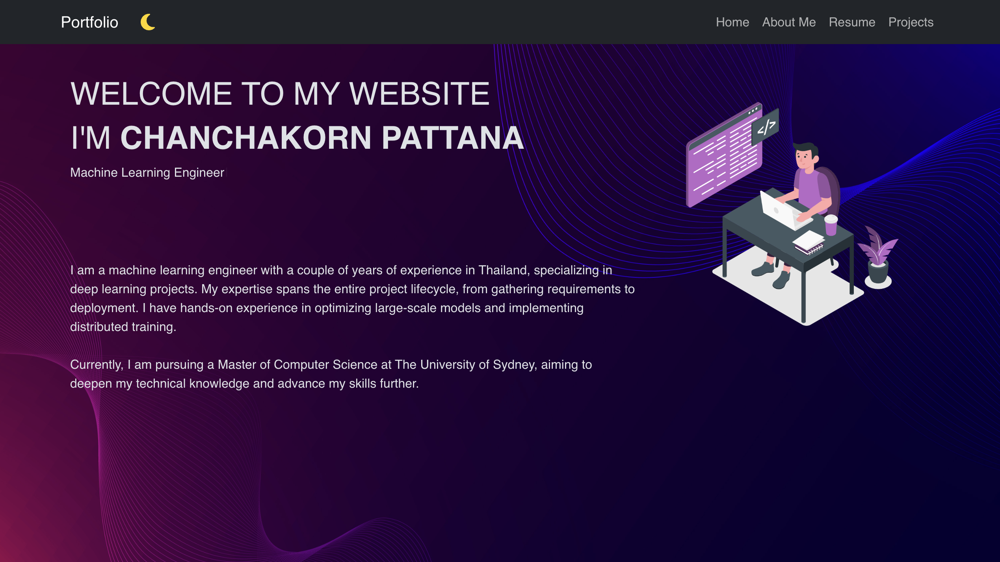
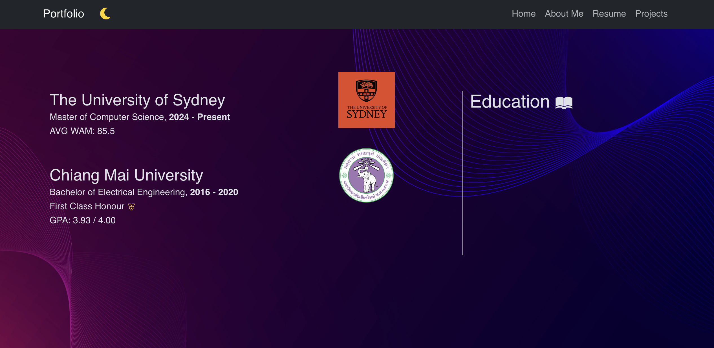

# Welcome to my personal portfolio website! 🚀

This project showcases my skills, projects, and achievements as a Machine Learning Engineer. The website is hosted on Vercel and can be accessed at [Portfolio](http://) URL.

## Getting Started

### Prerequisite

**Node.js** 
**npm**

### Installation
1. Install Dependencies:
`npm install` 

2. Start the development server:
`npm start`

3. Open the app in your browser at 
`http://localhost:3000`
